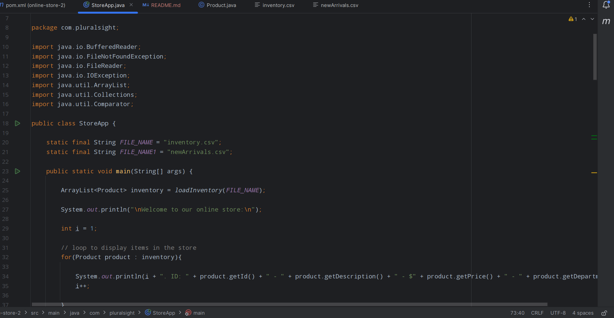

# African Food Store Online

## Description of the Project

The African Food Store Online is a Java console application designed to provide an intuitive online shopping experience for customers interested in African cuisine. It seamlessly integrates with inventory data stored in 'inventory.csv' and facilitates effortless inventory updates by syncing with 'newArrivals.csv'. This functionality ensures smooth operations, keeping the store up-to-date with the latest products and inventory levels. The application caters to users who want to explore and purchase authentic African food products conveniently from their home.

## User Stories

- As a user, I want to be able to input my data, so that the application can process it accordingly.
- As a user, I want to receive immediate feedback, so I can understand what to do next.

## Setup

### Prerequisites

- [IntelliJ IDEA](https://www.jetbrains.com/idea/download/): Ensure you have IntelliJ IDEA installed.
- Java SDK: Make sure Java SDK is installed and configured in IntelliJ.

### Running the Application in IntelliJ

1. Open IntelliJ IDEA.
2. Select "Open" and navigate to the directory where you cloned or downloaded the project.
3. After the project opens, wait for IntelliJ to index the files and set up the project.
4. Find the main class with the `public static void main(String[] args)` method.
5. Right-click on the file and select 'Run 'YourMainClassName.main()'' to start the application.

## Technologies Used

- Java 22
- IntelliJ IDEA

## Demo

## Future Work

Potential future enhancements or functionalities:
- Implementing user authentication and authorization.
- Enhancing the user interface with more interactive features.
- Integrating a payment gateway for online transactions.

## Resources

- [w3schools](https://www.w3schools.com/java/)
- [Think Java](https://www.amazon.com/Think-Java-Like-Computer-Scientist/dp/1492072508/ref=asc_df_1492072508?tag=bingshoppinga-20&linkCode=df0&hvadid=79920843350879&hvnetw=o&hvqmt=e&hvbmt=be&hvdev=c&hvlocint=&hvlocphy=&hvtargid=pla-4583520391512125&psc=1)

## Thanks

- Thank you to Mr. Raymond Maroun for continuous support and guidance.

